# ProhoriPay — Architecture

## Architecture Diagram

```mermaid
flowchart TD
    %% ── Provider Isolation Lanes ──────────────────────────────────────────
    subgraph LANES["Provider Isolation Lanes"]
        direction TB
        BK["bKash\n(synthetic feed)"]
        NG["Nagad\n(synthetic feed)"]
        RK["Rocket\n(synthetic feed)"]
    end

    subgraph PIL["Provider Isolation Layer"]
        direction TB
        PIL_A["Each provider's pool_effects\ncomputed and stored SEPARATELY.\nbKash cannot read Nagad's data.\nThe ONLY shared resource is\nphysical cash."]
    end

    %% ── Synthetic Data + Simulation ───────────────────────────────────────
    subgraph SYNTH["Synthetic Data + Simulation Clock"]
        direction TB
        SEED["Seed generator\nFaker + numpy · seed 1\nRef: 2026-07-11 12:00 UTC\nbackend/app/modules/synth/"]
        DB[("SQLite DB\nAgent · Pool · Transaction\nAlert · Case · CaseEvent\nbackend/prohoripay.db")]
        CLOCK["Simulation clock\nSIM_SEED=7 · 5 min/tick · 2 ticks/sec\nbackend/app/modules/sim/clock.py\nDemo controls:\neid_rush · inject_anomaly\nbreak_feed · restore_feed"]
        SEED -->|"python -m app.core.seed\n(idempotent)"| DB
        CLOCK -->|"tick: apply signed pool_effects\nupdate current_balance"| DB
    end

    %% ── Deterministic Analytics Engine ────────────────────────────────────
    subgraph ANALYTICS["Deterministic Analytics Engine\n(pandas / numpy / scikit-learn — NO LLM)"]
        direction TB
        FORECAST["Liquidity Forecast\nGET /api/forecast\n• EMA burn rate · 30-min window\n• trend: accelerating/easing/steady/filling\n• projection_state: projected/filling/\n  insufficient_data/intermittent/at_floor\n• minutes_to_depletion\n• confidence = f(volatility, sample_size,\n  data_freshness)\nbackend/app/modules/forecast/"]

        ANOMALY["Anomaly Detection\nGET /api/alerts\n• detect_structuring\n  (≥6 near-identical amounts, ≤5 accounts, 90 min)\n• detect_velocity\n  (rate ≥ 4× event-adjusted baseline)\n• detect_off_hours\n  (rate >> hour-of-day expected)\n• detect_balance_inconsistency\n• IsolationForest: confidence bump only,\n  never sole justification\nbackend/app/modules/alerts/"]

        FORECAST -->|"status critical/watch\n→ liquidity alert"| ANOMALY
    end

    %% ── Coordination + Audit Trail ────────────────────────────────────────
    subgraph COORD["Case Coordination + Audit Trail"]
        direction TB
        CASES["Auto-create case per alert\nliquidity → field_officer\nanomaly → risk_reviewer\nGET|POST /api/cases\n• raised → routed → acknowledged\n  → escalated → resolved\n• Immutable append-only history\n• SLA timer; auto-escalate on breach\n• Human actor required on every transition\nbackend/app/modules/cases/"]
    end

    %% ── Degraded Feed Path ────────────────────────────────────────────────
    subgraph DEGRADED["Degraded-Feed Path (Scenario C)"]
        direction LR
        BREAK["POST /api/sim/break_feed\nmode: stale → modifier=0.4\nmode: late  → modifier=0.6"]
        FEED_META["meta.data_quality ≠ 'ok'\nconfidence_modifier < 1.0\nPer-pool: freshness_by_pool\nFrontend MUST show caution\nNever present confident conclusion"]
        BREAK --> FEED_META
    end

    %% ── SSE Live Stream ───────────────────────────────────────────────────
    subgraph SSE_BOX["SSE Live Stream  GET /api/stream"]
        direction TB
        SSE_EVENTS["Events:\ntick · balance_update · forecast_update\nalert_new · case_update · feed_status"]
    end

    %% ── Groq Explanation Layer (DOWNSTREAM ONLY) ──────────────────────────
    subgraph GROQ["Groq LLM — Explanation Only\n(NEVER feeds analytics)"]
        direction TB
        EXPLAIN["POST /api/explain\n{kind, id, lang: en|bn|banglish}\n• Backend loads authoritative structured\n  object by id — never trusts client numbers\n• Feeds only finished results to Groq\n• Safety guard: banned words check\n• Fallback: deterministic template\n  (always present; Groq unavailable OR\n  guard fails → fallback, never LLM output)\n• Cached by (kind, id, lang, data-hash)\nbackend/app/modules/llm/"]
        FALLBACK["Deterministic template fallback\n(instant; no Groq call)"]
        EXPLAIN -->|"guard failure or timeout"| FALLBACK
    end

    %% ── Next.js Dashboard ─────────────────────────────────────────────────
    subgraph FRONTEND["Next.js Dashboard  localhost:3000"]
        direction TB
        HERO["Hero card\nTotal Holdings — labeled as sum of\nnon-interchangeable pools\nConstraining pool + status chip"]
        POOL_BRK["Pool breakdown\nPhysical Cash · bKash · Nagad · Rocket\n(separate, with individual status)"]
        ALERT_FEED["Alert feed\nEvidence · confidence · case link"]
        CASE_VIEW["Case view\nLifecycle + immutable audit trail"]
        EXPLAIN_VIEW["NL explanations\n(Groq or fallback, per pool/alert)"]
        DEMO_CTRL["Demo controls\n(presenter-driven)"]
        DQ_BANNER["Data-quality caution\n(shown when meta.data_quality ≠ 'ok')"]
    end

    %% ── Connections ───────────────────────────────────────────────────────
    BK --> PIL
    NG --> PIL
    RK --> PIL

    PIL --> SYNTH

    DB -->|"signed pool_effects per provider"| ANALYTICS
    ANALYTICS --> COORD
    COORD --> SSE_BOX
    ANALYTICS --> SSE_BOX

    DEGRADED -->|"freshness_by_pool\ndegrades confidence"| ANALYTICS

    SSE_BOX --> FRONTEND
    DB -->|"REST snapshots\non reconnect"| FRONTEND

    ANALYTICS -.->|"structured result\n(id reference only,\nnever raw numbers)"| GROQ
    GROQ --> EXPLAIN_VIEW

    %% ── Styling ───────────────────────────────────────────────────────────
    style GROQ        fill:#fff8e1,stroke:#f9a825,color:#555
    style LANES       fill:#e8f5e9,stroke:#2e7d32
    style PIL         fill:#e8f5e9,stroke:#2e7d32
    style ANALYTICS   fill:#e3f2fd,stroke:#1565c0
    style COORD       fill:#f3e5f5,stroke:#6a1b9a
    style DEGRADED    fill:#fff3e0,stroke:#e65100
    style SSE_BOX     fill:#fce4ec,stroke:#c62828
    style SYNTH       fill:#f1f8e9,stroke:#558b2f
    style FRONTEND    fill:#ede7f6,stroke:#4527a0
```

---

## Component Walkthrough

### Provider Isolation Lanes

bKash, Nagad, and Rocket are treated as three separate data sources that enter the system through independent lanes. Every transaction is tagged with exactly one provider at write time. The `pool_effects` list on each transaction contains one entry for the provider e-money pool and one entry for the physical cash pool — but each provider's e-money pool is its own separate entity. No service, query, or detector aggregates raw e-money balances across providers. The only cross-pool view in the system is the Hero card's labeled "Total Holdings" — which is explicitly labeled as a sum of separate, non-interchangeable pools, never presented as a single spendable balance.

### Synthetic Data + Simulation Clock

**At seed time** (`python -m app.core.seed`), the generator (`backend/app/modules/synth/generator.py`) builds a 3-hour transaction history from a fixed seed (1) and reference date (2026-07-11). It injects three labeled anomaly clusters (39 transactions total) whose ground-truth labels are stored server-side and never returned by any API. Immediately after seeding, `run_detection` pre-generates alerts so the dashboard is populated on first load.

**At runtime**, the simulation clock (`backend/app/modules/sim/clock.py`) advances synthetic time in 5-minute ticks at 2 ticks/second (configurable). Each tick applies new direction-aware transactions, updates pool balances via signed pool_effects, recomputes forecasts, runs incremental detection, evaluates SLA escalations, and publishes typed SSE events. The clock uses its own independent seed (7) so live traffic never collides with the seeded history.

### Deterministic Analytics Engine

Two engines, both pure Python (no LLM):

**Liquidity Forecast** (`backend/app/modules/forecast/`): Per pool, independently. Computes a recency-weighted EMA of net signed flow per minute over a 30-minute analysis window (`analysis_window_minutes = 30`, `ema_span = 10`). Classifies `projection_state` (projected / filling / insufficient_data / intermittent / at_floor), derives `minutes_to_depletion`, and bucketed confidence. Status thresholds: `critical_minutes = 30.0`, `watch_minutes = 90.0`. The safety floor is per-pool: physical_cash = 10,000 BDT; provider pools = 5,000 BDT each.

**Anomaly Detection** (`backend/app/modules/alerts/`): Four rule detectors, all context-aware:
- `detect_structuring`: near-identical amounts (±5%), ≤5 accounts, ≥6 transactions, 90-minute window.
- `detect_velocity`: rate ≥ 4× the baseline; during a known event (Eid/salary), the effective baseline is raised 2× so ordinary surge volume is not flagged.
- `detect_off_hours`: rate >> expected rate for the hour-of-day (from the multiplier table); only fires outside known event windows.
- `detect_balance_inconsistency`: stored vs recomputed balance from pool_effects; fires on degraded/stale feeds.

An optional secondary IsolationForest (`contamination=0.12`, `random_state=0`) can raise confidence by 0.05 on an already-evidenced finding but **never creates a finding on its own**.

### Case Coordination + Audit Trail

Every alert (liquidity or anomaly) auto-creates one case routed to the appropriate human role. Cases carry an immutable, append-only `history` list recording every transition (stage, actor, timestamp, detail). The SLA timer (`sla_minutes`) is set per case type; `evaluate_escalations` runs on every tick and auto-escalates cases whose SLA has been breached by `sim_time`. All transitions (`/ack`, `/escalate`, `/resolve`) require a human `actor` field — no case closes automatically.

### Degraded-Feed Path (Scenario C)

`POST /api/sim/break_feed {"provider": "nagad", "mode": "stale"}` sets Nagad's `confidence_modifier = 0.4`. This is propagated as `freshness_by_pool` into both the forecast engine (reducing that pool's confidence) and the anomaly service (reducing alert confidence for Nagad transactions). The SSE stream emits a `feed_status` event. The frontend must display a data-quality caution banner and must not present a confident conclusion. `restore_feed` resets the modifier to 1.0.

### Groq — Downstream Explanation Only

`POST /api/explain` receives a `{kind, id, lang}` request. The backend loads the authoritative structured object from the database by `id` — it never uses client-supplied numbers. The structured result (burn rate, evidence list, confidence, minutes_to_depletion) is handed to Groq with a strict system prompt: explain only the provided facts; invent no numbers; 2–4 sentences; end with a human-review note; banned words enforced. A post-generation safety guard checks every response; any violation triggers the deterministic template fallback. Results are cached by `(kind, id, lang, data_hash)`. Groq is **never consulted during forecast computation, anomaly detection, or case routing** — it is purely a translation layer on finished results.

### SSE Live Stream

`GET /api/stream` (text/event-stream). The client receives typed events: `tick`, `balance_update`, `forecast_update`, `alert_new`, `case_update`, `feed_status`. Each event carries a complete payload in the same shape as the corresponding REST endpoint, so clients treat SSE events as authoritative refreshes. On reconnect, the client re-fetches REST snapshots then resumes the stream.
